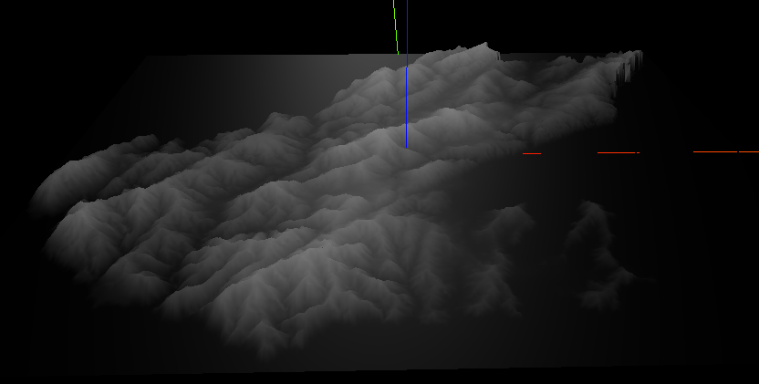

Wellington 3D
==============

3D rendering exploration of Wellington elevation. 

* Following [this guy's](http://blog.thematicmapping.org/2013/10/terrain-building-with-threejs-part-1.html) tutorial.
* Using Digital Elevation Models found from [koordinates](https://koordinates.com/search/?q=wellington+nz).

## So far...

## Next steps
* Investigate better textures
* Import Strava data from single ride and overlay